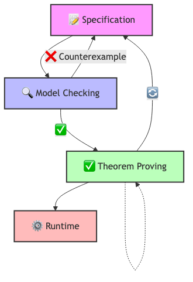

# Formal Verification of Modern Systems

This repository accompanies the book chapter on formal verification of modern systems, demonstrating the application of TLA+ across various domains:

- IoT Systems
- Peer-to-Peer Networks
- Blockchain Technology
- Quantum Protocols

## System Overview

The example system models a smart grid infrastructure that integrates:
1. Energy metering and anomaly detection at the edge
2. P2P network for secure communication
3. Blockchain for immutable audit trails
4. Quantum teleportation for secure information transfer

## Workflow

The formal verification process follows this workflow:



## Module Structure

The system is divided into four main TLA+ modules:

1. `EnergyMeter.tla`
   - Edge device anomaly detection
   - State management and billing
   - Safety properties for meter operation

2. `P2PNetwork.tla`
   - Secure peer-to-peer communication
   - Message routing and delivery
   - Network reliability properties

3. `Blockchain.tla`
   - Immutable event recording
   - Smart contract execution
   - Audit trail maintenance

4. `QuantumTeleportation.tla`
   - Secure quantum information transfer
   - BB4P protocol implementation
   - Quantum state integrity

## Setup and Verification

1. Install TLA+ Toolbox from https://lamport.azurewebsites.net/tla/toolbox.html
2. Open the `SmartGrid` specification in TLA+ Toolbox
3. Run TLC model checker using the provided configuration files
4. Verify properties in each module's configuration file

## Key Properties Verified

- Type safety across all modules
- Anomaly detection and response
- Secure message delivery
- Immutable audit trails
- Quantum state preservation

## Directory Structure

- `tla_modules/` - Main TLA+ specification modules
- `tla_modules/tlc_configs/` - TLC model configuration files
- `workflow/` - System architecture diagrams


```bash
git clone https://github.com/yourusername/formal-verification.git
```

## Contributing

1. Create a new specification in the `specs` directory
2. Add model checking configurations in the `models` directory
3. Document your findings in the `docs` directory


## License

This software is licensed for NON-COMMERCIAL use only. For commercial use, please contact prof.dr.rer.nat.lu@gmail.com.

For more details, see the LICENSE file.
