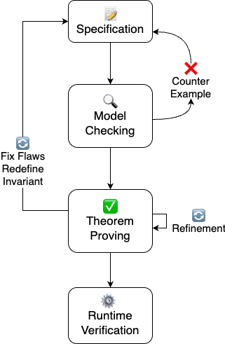

# Formal Verification of Modern Systems

This repository accompanies the book chapter on formal verification of modern systems, demonstrating the application of TLA+ across various domains:

- IoT Systems
- Peer-to-Peer Networks
- Blockchain Technology
- Quantum Protocols

## System Overview

The example system models a smart grid infrastructure that integrates:
1. Energy metering and anomaly detection at the edge
2. P2P network for secure communication
3. Blockchain for immutable audit trails
4. Quantum teleportation for secure information transfer

## Workflow

The formal verification process follows this workflow:



## Module Structure

The system is divided into four main TLA+ modules:

1. `EnergyMeter.tla`
   - Edge device anomaly detection
   - State management and billing
   - Safety properties for meter operation

2. `P2PNetwork.tla`
   - Secure peer-to-peer communication
   - Message routing and delivery
   - Network reliability properties

3. `Blockchain.tla`
   - Immutable event recording
   - Smart contract execution
   - Audit trail maintenance

4. `QuantumTeleportation.tla`
   - Secure quantum information transfer
   - BB4P protocol implementation
   - Quantum state integrity

## Setup and Verification

### TLA+ Module Structure
Each TLA+ module follows this structure:

```tla
-------------------------------- MODULE ModuleName --------------------------------
EXTENDS Integers, Sequences, TLC, String, Nat

CONSTANTS YourConstants
VARIABLES YourVariables

Init == 
  /\ YourInitialConditions

Next == 
  YourNextStateRelation

Spec == Init \/ [][Next]_vars

=============================================================================
```

### Running TLC
1. Open TLA+ Toolbox
2. Create or open a specification:
   - Go to File → New → Specification
   - To verify a module, choose the module file
   - Enter the exact module name
   - Load the module and let the parser check it

3. Add all modules:
   - Right-click on the specification
   - Select "Add Module"
   - Add:
     - EnergyMeter.tla
     - P2PNetwork.tla
     - Blockchain.tla
     - QuantumTeleportation.tla

4. Create models for each module:
   - Right-click on each module
   - Select "New Model Using Module"
   - Name it appropriately (e.g., "EnergyMeter Model")
   - Click "OK"

5. Configure each model:
   - Click on the model in the left panel
   - In the right panel, click "Model Overview"
   - Set the following:
     - "What is the behavior spec?" → "Spec"
     - "What is the model checking task?" → "Check the temporal formula Spec"
     - "What temporal properties should be checked?" → Add all properties from the .cfg files
     - "What invariants should be checked?" → Add all invariants from the .cfg files

6. Run the verification:
   - Click the "Run Model" button (green play icon)
   - Wait for TLC to complete the verification
   - Check the results in the "Model Checking Results" tab

### Common Issues
- If TLC runs out of memory:
  - Increase the heap size in TLA+ Toolbox preferences
  - Set a larger value for "Maximum heap size (MB)"

- If state space is too large:
  - Use the "Finite State Space" option in model configuration
  - Limit the number of states to check
  - Use symmetry reduction if applicable

### Interpreting Results
- "No errors found" means all properties are satisfied
- "State space exhausted" means TLC couldn't explore all states
- "Counterexample found" indicates a property violation
- Check "Model Checking Results" for detailed information

### Debugging Tips
- Use the "Step" feature to manually explore states
- Add "Print" statements in your specification
- Use "Debug" mode to pause at specific states
- Check TLC statistics for performance issues

### TLA+ Best Practices
1. Use proper module headers and footers
2. Document your constants and variables
3. Use meaningful variable names
4. Keep specifications modular and reusable
5. Add comments for complex operations
6. Use type annotations where possible
7. Test with small models first
8. Use TLC statistics to optimize performance

## Empirical TLC Validation (Reusable Workflow)

This repository includes a reusable empirical TLC workflow that can be applied to any subproject with TLA+ modules and `.cfg` files.

### What the workflow provides

- Multi-scenario TLC execution from one command
- Three repeated runs per scenario by default
- Statistical timing report: mean, sample standard deviation, and 95% confidence interval
- CSV, JSON, console summary, and LaTeX output for paper integration

### Scripts (kept at repository root)

- `run_tlc_validation.sh`: executes TLC scenarios and writes `results/tlc_results.csv`
- `analyze_tlc_results.py`: reads results and prints publication-ready summary tables

### Quick start (current project example)

Run the default scenario suite:

```bash
cd /Users/tianxiang.lu/dev/formal-verification
./run_tlc_validation.sh
./analyze_tlc_results.py
```

Run with the high-scale stress test (`~1M` states):

```bash
RUN_MILLION_SCALE=1 ./run_tlc_validation.sh
./analyze_tlc_results.py
```

### Reuse for other subprojects

The runner is parameterized through environment variables, so it can be reused across subprojects without changing script code.

```bash
MODULE_DIR=/path/to/subproject/tla_modules \
MODULE_NAME=YourMainModule \
TLA_JAR_PATH=/path/to/tla2tools.jar \
RESULTS_DIR=/path/to/output/results \
SCENARIOS="S1:Config1.cfg;S2:Config2.cfg;S3:Config3.cfg" \
RUNS_PER_SCENARIO=3 \
./run_tlc_validation.sh

RESULTS_DIR=/path/to/output/results ./analyze_tlc_results.py
```

### Scenario format

Set `SCENARIOS` as a semicolon-separated list of `ScenarioName:ConfigFile` pairs:

```bash
SCENARIOS="Baseline:MainCheck_Strict.cfg;Relaxed:MainCheck_NoUniqueness.cfg"
```

### Interpreting empirical results

- `TotalStates` and `DistinctStates` quantify explored state space
- `MeanWallTime(ms)` is mean wall-clock runtime over repeated runs
- `CI95HalfWidth(ms)` is the 95% confidence interval half-width for runtime
- `ViolationsFound=Yes` indicates property/invariant violations were detected

### Notes for paper reporting

- Report `mean ± 95% CI` instead of single-run time to improve statistical rigor
- Include the largest-state scenario as the scalability stress test
- Keep per-scenario logs from `results/logs/` for reproducibility

### Command reference

Run everything:

```bash
./run_tlc_validation.sh && ./analyze_tlc_results.py
```

Run one or more specific scenarios:

```bash
SCENARIOS="StrictOnly:MainCheck_Strict.cfg" ./run_tlc_validation.sh
```

Run with the million-scale scenario (if `MainCheck_MillionScale.cfg` exists):

```bash
RUN_MILLION_SCALE=1 ./run_tlc_validation.sh
```

Run with the breakdown witness scenario (requires refinement witness module):

```bash
MODULE_NAME=MainCheckRefinementWitness RUN_BREAKDOWN_WITNESS=1 ./run_tlc_validation.sh
```

Inspect results:

```bash
cat results/tlc_results.csv | column -t -s,
ls -lt results/logs/
```

Analyze a custom CSV location:

```bash
./analyze_tlc_results.py /path/to/results/tlc_results.csv
```

### Scenario catalog (current project)

| Scenario | Config file | Intent |
|---|---|---|
| Strict | `MainCheck_Strict.cfg` | Baseline with full consistency checks |
| No Uniqueness | `MainCheck_NoUniqueness.cfg` | Relax uniqueness assumption |
| Medium Scale | `MainCheck_MediumScale.cfg` | Measure state-space/runtime growth |
| Minimal Constraints | `MainCheck_MinimalConstraints.cfg` | Baseline type-focused validation |
| Million Scale | `MainCheck_MillionScale.cfg` | Stress-test scalability (>1,000,000 states) |

### Troubleshooting checklist

- `java: command not found`: install Java and verify `java -version`.
- `ClassNotFoundException: tlc2.TLC`: ensure `TLA_JAR_PATH` points to `tla2tools.jar`.
- Unexpected failures in one scenario: inspect matching file in `results/logs/`.
- Runtime too long: reduce config cardinalities or set lower `TLC_STOP_AFTER_SECONDS`.
- No rows in analysis: ensure `results/tlc_results.csv` exists and has scenario data.

### Recommended supplementary artifacts

Include these with paper submission when possible:

- `results/tlc_results.csv`
- `results/tlc_results.json`
- `results/logs/*`
- `tla_modules/MainCheck_*.cfg`
- Core specs used in validation (`*.tla`)

## Key Properties Verified

- Type safety across all modules
- Anomaly detection and response
- Secure message delivery
- Immutable audit trails
- Quantum state preservation

## Directory Structure

- `tla_modules/` - Main TLA+ specification modules
- `tla_modules/tlc_configs/` - TLC model configuration files
- `workflow/` - System architecture diagrams


```bash
git clone https://github.com/yourusername/formal-verification.git
```

## Contributing

1. Create a new specification in the `specs` directory
2. Add model checking configurations in the `models` directory
3. Document your findings in the `docs` directory


## License

This software is licensed for NON-COMMERCIAL use only. For commercial use, please contact prof.dr.rer.nat.lu@gmail.com.

For more details, see the LICENSE file.
