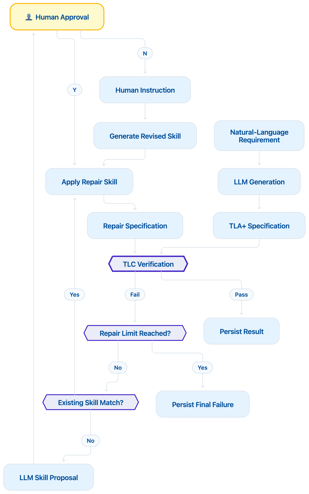

# Agentic Loop: Verifier-Guided Repair of LLM-Generated Formal Specifications

---

## Project Overview

This subproject implements a **skill-mediated, verifier-in-the-loop workflow** for repairing LLM-generated TLA+ specifications, as introduced and evaluated in the companion paper:

> **Lu, T. (2026)**. _Verifier-Guided Repair of LLM-Generated TLA+ Specifications: A Skill-Mediated Agentic Loop for NASA DDMR-26._ IEEE ETECOM 2026, Paris, France.

The workflow combines LLM-based generation from natural-language requirements with TLC model checking, modular skill-based repair, and explicit human-in-the-loop governance for synthesizing new repair knowledge. This achieves **substantial increases in TLC verification coverage with strict regression-proofing and full auditability.**

All experiment artifacts, generated models, TLC diagnostics, repair skills, logs, seeds, prompts, and result metrics are released for _full reproducibility_ ([see paper/link for dataset](https://github.com/Prof-it/formal-verification/tree/main/agentic_loop)).

---

## Verifier-in-the-Loop Architecture & Principles

- **Skill-mediated, regression-proof repair**
  - A bounded repair loop applies reusable, human-approved repair skills to recognized TLC failures. Previously unrecognized failure types trigger LLM-generated skill proposals, which require explicit human approval before being added to the persistent skill registry.
  - All repairs are strictly TLC-gated: no unverified fix can ever overwrite or regress an already TLC-passing artifact. _Structural regression to previously-passing artifacts is architecturally impossible._
  - No model-parameter update or autonomous learning is present. _All memory is governed by explicit, human-accepted rules (skills)._

- **Conditional workflow and experimental pairing**
  - Each trial uses an identical initial LLM-generated TLA+ specification for both "baseline" (one-shot) and conditional repair evaluation. This ensures strict pairing and statistical validity.
  - Only initially TLC-failing specs enter repair; initially passing specs are preserved by design and never modified in this workflow.

- **Transparency and modularity**
  - The repair loop applies exactly one repair rule per attempt (modularity discipline). All LLM proposals are subject to explicit human review for rule acceptance.
  - All experiment traces, configuration, rule decisions, TLC outputs, and artifact generations are fully logged for each trial.
  


---

## Key Experimental Results (NASA DDMR-26, N=100)

|         | TLC Passes | TLC Fails | Attempted Repairs | Rescued | Repair Success Rate |
|---------|------------|-----------|-------------------|---------|--------------------|
| Baseline |    20      |    80     |      —            |   —     |       —            |
| Loop    |    88      |    12     |      80           |   68    |   85.0% (CRSR)     |

- **Baseline TLC pass rate:** 20.0% (20/100)
- **Final (post-repair) TLC pass rate:** 88.0% (88/100)
- **Conditional Rescue Success Rate (CRSR):** 68/80 = 85.0%
- **Regressions:** 0 _(every initially TLC-passing artifact is preserved)_
- **Statistical test:** McNemar's exact test on 68 discordant pairs, 0 regressions, $p=6.78 \times 10^{-21}$

Full breakdown and per-class repairability analysis are included in [$results/`](results/).

#### Failure Class Repairability (Selected)

| Failure Pattern                          | Baseline Cases | Repair Attempts | Repairs | Rate    |
|------------------------------------------|:--------------:|:--------------:|:-------:|:-------:|
| Missing next-state assignment            |      27        |      29        |  27     | 93.1%   |
| Generic operator/function hallucination  |      —         |      52        |  41     | 78.8%   |
| IF/THEN/ELSE parse error                 |      —         |      4         |   4     | 100%    |
| Semantic boolean evaluation              |       3        |      6         |   0     | 0%      |
| Unmatched/unknown (coverage gap)         |      50        |     68         |  41     | 82%     |

See also [$results/comparison_*/comparison_*.md`](results/) for full output table.

---

## Main Method: Summary

1. **Paired LLM Generation:** For each trial, a natural-language requirement (e.g., NASA DDMR-26) is converted to TLA+ via LLM using a domain scaffold, producing identical initial specs for both modes.
2. **Baseline Verification:** The specification is first checked by TLC. If TLC passes, no repair is needed, and this spec is preserved.
3. **Conditional Repair Loop:** If TLC fails, the diagnostic is mapped to a reusable repair skill, applying the fix. Unmatched diagnostics trigger LLM-suggested skill proposals, which _require explicit human acceptance_ before being added/persisted.
4. **Iteration Limits:** Each TLC-failing trial may attempt up to two rounds of modular repair; rounds terminate on TLC success.
5. **Full Audit:** All generations, TLC outputs, human approvals, rules, and metrics are persisted for downstream audit and reproducibility.

---

## Usage & Reproducing the Experiment

The workflow is isolated, entirely auditable, and supports both _live LLM_ (e.g., OpenAI GPT-4o) and _replay_ (cached-output) runs:

### Example CLI Run (10 trials, live LLM)
```sh
cd agentic_loop
source .venv/bin/activate
PYTHONPATH=src python -m agentic_loop.compare_cli \
  --task tasks/nasa_ddmr26_sample.yaml \
  --tla-jar tla/tla2tools.jar \
  --module-dir tla \
  --prompts-dir prompts \
  --prompt-mode one_shot \
  --max-iterations 2 \
  --provider openai \
  --model gpt-4o \
  --output-dir results/comparison \
  --num-trials 100
```

### Exact Replay (reproducibility/audit)
```sh
PYTHONPATH=src python -m agentic_loop.compare_cli \
  ... \
  --provider replay \
  --replay-dir replay_outputs
```

#### Output Structure:
- Trial-by-trial metrics in `results/comparison/<taskname>/baseline/`, `.../loop/`, and `.csv`/`.md` summary tables.
- All artifacts (TLA+, `.cfg`, diagnostics, prompts, rule approvals, human feedback) are saved.

#### Requirements
- `tla2tools.jar`, domain scaffold files (`CLA_Generated.tla`, `CLA_generation_eval.cfg`, etc.) must be available in `tla/`.
- All commands are run from `/agentic_loop/`.

---

## Implementation Highlights

- Paired, regression-proof experiment control and result logging
- Modular skill-based repair architecture with explicit _human-in-the-loop skill approval_ for every new repair strategy
- TLC used as the authoritative executable verification signal for loop gating
- Bounded repair iterations per trial
- All experiment metadata, repair rules, TLC outputs, and human feedback are released (CSV, JSON, Markdown)


---

## 📚 Publication & Citation

This repository accompanies:

**Lu, T. (2026).** _Verifier-Guided Repair of LLM-Generated Formal Specifications: A Paired Study on NASA DDMR-26_. In: _IEEE 2026 International Conference on Emerging Trends in Engineering and Computing (ETECOM)_, Paris, France, 26–27 October 2026. Camera-ready.

```bibtex
@inproceedings{lu2026verifier,
  author    = {Lu, Tianxiang},
  title     = {Verifier-Guided Repair of LLM-Generated Formal Specifications: A Paired Study on NASA DDMR-26},
  booktitle = {IEEE 2026 International Conference on Emerging Trends in Engineering and Computing (ETECOM)},
  year      = {2026},
  address   = {Paris, France},
  month     = oct,
  note      = {Camera-ready; conference scheduled for 26--27 October 2026}
}
```
